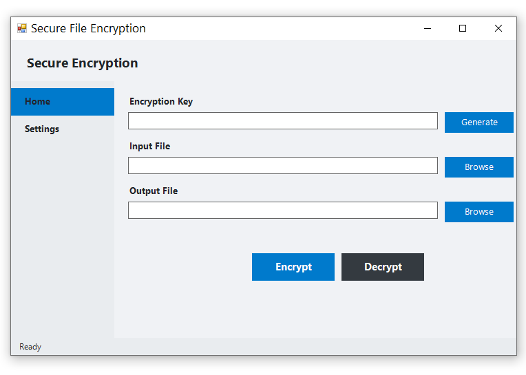

# Secure File Encryption

<p align="center">
  
</p> 
*Encrypt your files with confidence—simple, sleek, and secure.*

Welcome to **Secure File Encryption**, a lightweight desktop tool built to keep your sensitive files safe with just a few clicks. Whether you’re safeguarding personal documents or protecting business secrets, this app combines modern design with robust AES encryption to give you peace of mind. No bloat, no fuss—just a clean, professional experience.

---

## ✨ Why You'll Love It

- **Dead-Simple Interface**: Minimal, modern, and intuitive—encryption doesn’t get easier than this.
- **Powerful Security**: Choose between 128-bit, 256-bit, or 512-bit AES encryption to match your needs.
- **Light & Dark Themes**: Switch between sleek light or stylish dark modes to suit your vibe.
- **Single-File Focus**: Encrypt or decrypt individual files with precision—no folder overwhelm.
- **Built for Windows**: Runs smoothly with admin privileges for full control.

Think of it as your personal file vault—elegant on the outside, ironclad on the inside.

---

## 🚀 Getting Started

Ready to lock down your files? Here's how to get rolling in minutes.

### Prerequisites
- Windows OS (tested on Windows 10/11)
- PowerShell 5.1 or later (comes with Windows)
- Administrative privileges (it’s a security thing!)

### Installation
1. **Clone or Download**:
   ```bash
   git clone https://github.com/yourusername/secure-file-encryption.git
   ```
   Or grab the ZIP from the releases page!

2. **Navigate to the Folder**:
   ```bash
   cd secure-file-encryption
   ```

3. **Run the Script**:
   - Right-click `bizcrypt.ps1` and select "Run with PowerShell".
   - Approve the UAC prompt (we need admin rights to keep things secure).
   - That’s it! The app will launch, and you’re ready to encrypt.

---

## 🎯 How to Use It

1. **Launch the App**: Fire up `bizcrypt.ps1`, and you’ll see a clean window with a sidebar.
2. **Generate a Key**: Click "Generate" to create a shiny new encryption key—or paste your own.
3. **Pick Your File**: Hit "Browse" next to "Input File" to select what you want to encrypt or decrypt.
4. **Set the Output**: Choose where your encrypted/decrypted file will land with "Browse" under "Output File".
5. **Encrypt or Decrypt**: Click "Encrypt" to lock it up or "Decrypt" to unlock it. Watch the status bar for updates!
6. **Tweak Settings (optional)**: Click "Settings" in the sidebar to switch themes or adjust key length.

**Pro tip**: Keep your key safe—it’s your ticket to unlocking those files later!

---

## ⚙️ Settings

Customize your experience:

- **Key Length**: Pick 128-bit (fast), 256-bit (balanced, default), or 512-bit (extra secure).
- **Theme**: Go Light for a bright, airy feel or Dark for a moody, modern look. Hit "Apply" to see the magic.

---

## 🛠️ Built With

- **PowerShell**: The backbone for scripting and execution.
- **C# with WinForms**: Powers the slick UI and encryption logic.
- **AES Encryption**: Industry-standard security baked right in.
